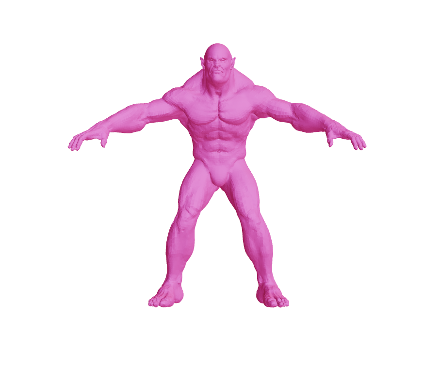
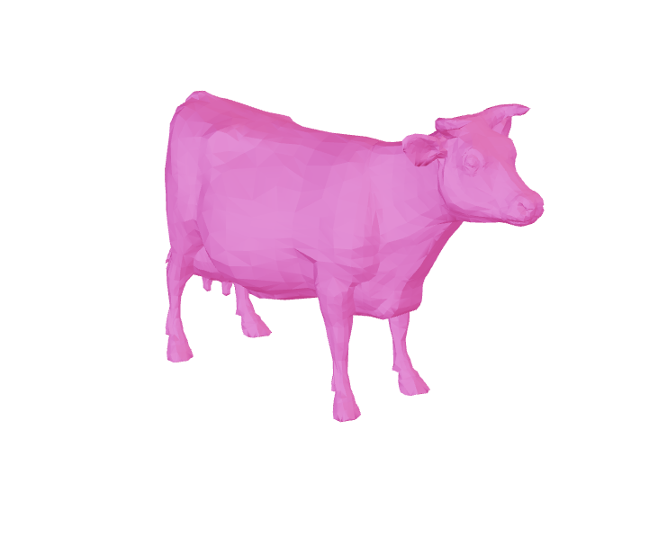
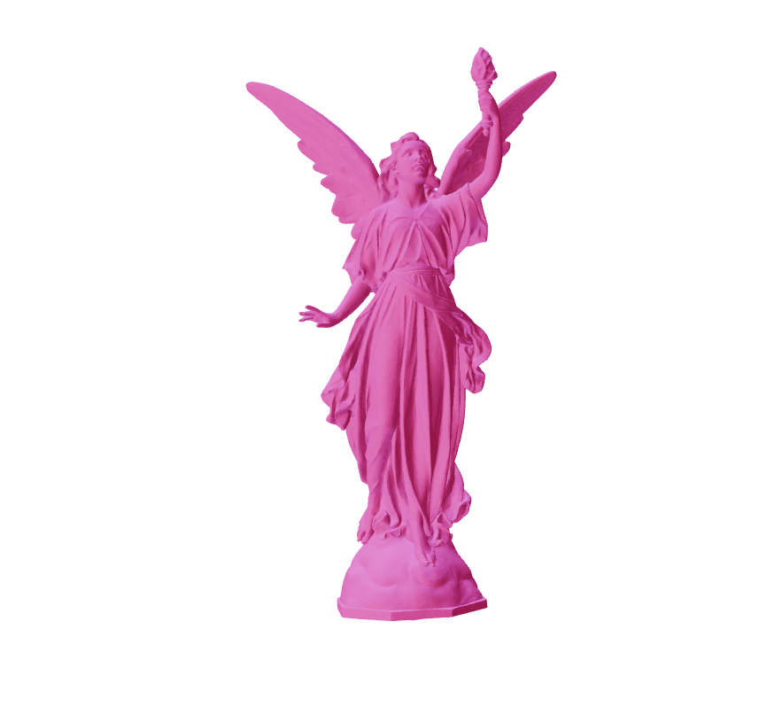
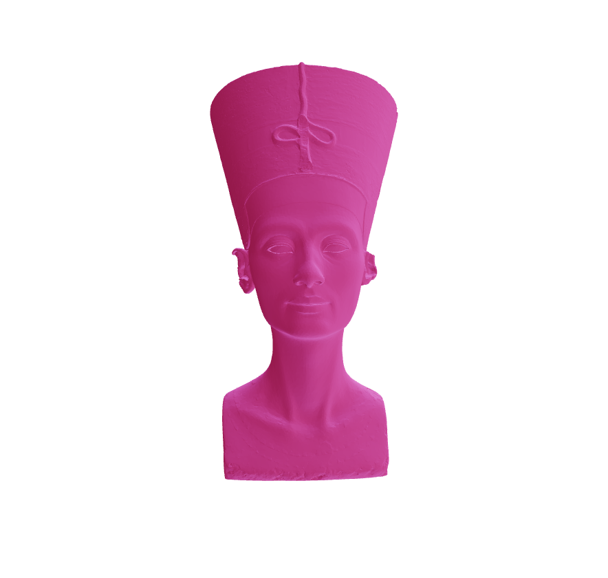
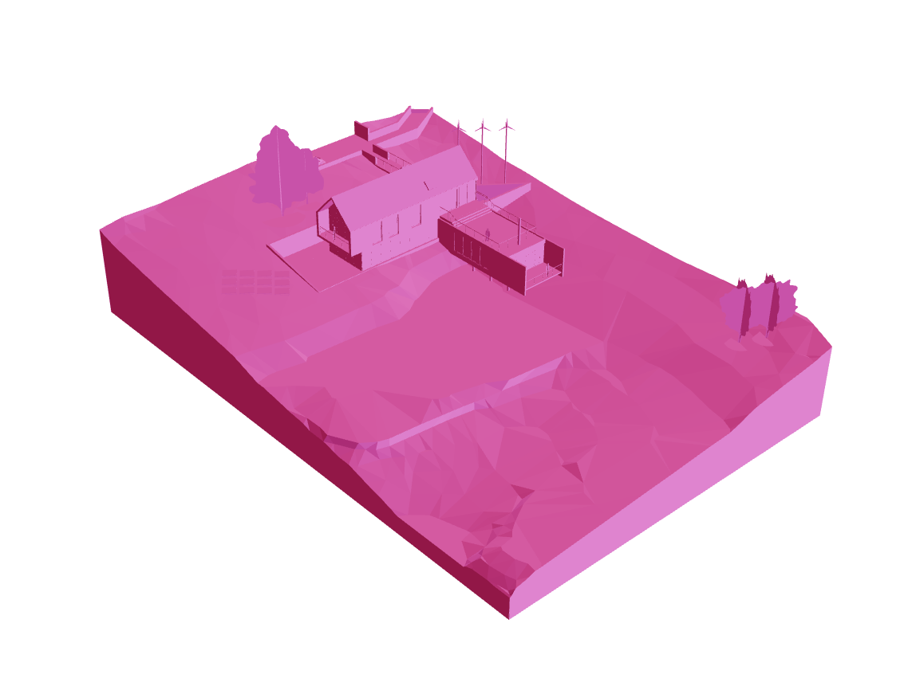
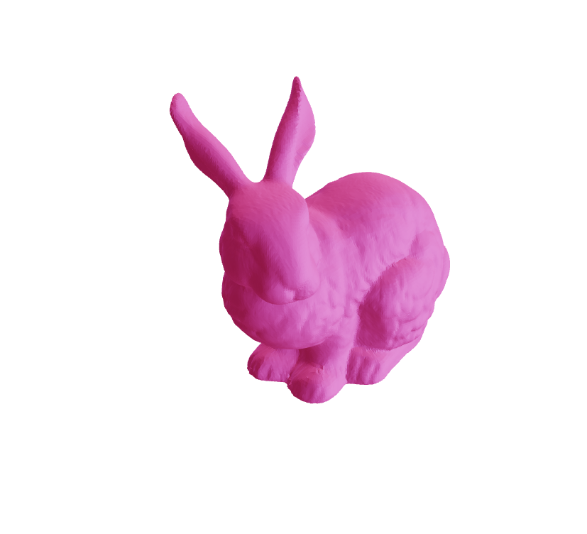
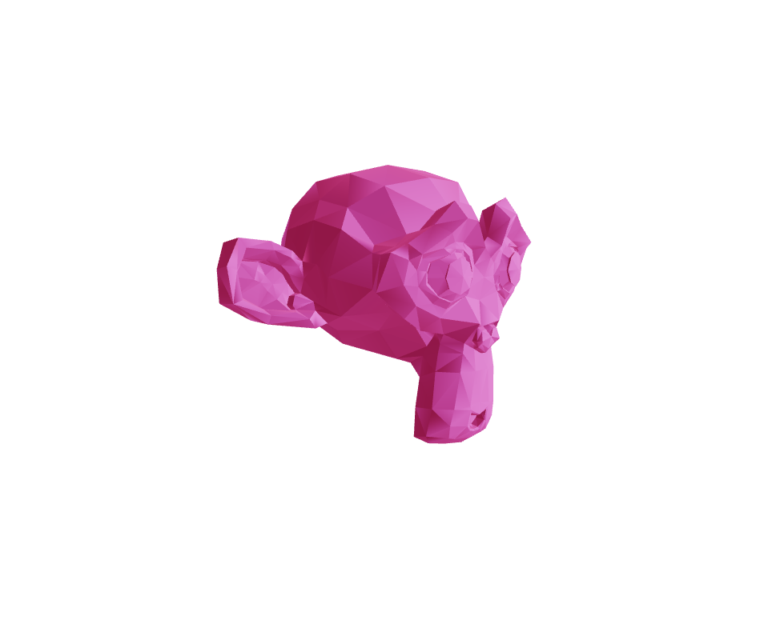

# 3D Sample Models

# About
This is a repository containing common 3D test models in multiple formats. For more details on each model access this Blog Post

## List of Common 3D Test Models

| Model Name |    Image   |     .obj   |    .gltf   |    .USDZ   |     .STL   |    .DAE    |    .FBX    |
|------------|------------|------------|------------|------------|------------|------------|------------|
| Beast |  | [.obj](https://s3.amazonaws.com/everse.assets/common3dmodels/OBJ/beast.obj) | [.gltf](https://s3.amazonaws.com/everse.assets/common3dmodels/GLTF/beast.gltf) | [.USD](https://s3.amazonaws.com/everse.assets/common3dmodels/USD/beast.usdz) | [STL](https://s3.amazonaws.com/everse.assets/common3dmodels/STL/beast.stl) | [DAE](https://s3.amazonaws.com/everse.assets/common3dmodels/DAE/beast.dae) | [FBX](https://s3.us-east-1.amazonaws.com/everse.assets/common3dmodels/FBX/beast.fbx) |
| Cow |  | [.obj](https://s3.amazonaws.com/everse.assets/common3dmodels/OBJ/cow.obj) | [.gltf](https://s3.amazonaws.com/everse.assets/common3dmodels/GLTF/cow.gltf) | [.USD](https://s3.amazonaws.com/everse.assets/common3dmodels/USD/cow.usdz) | [STL](https://s3.amazonaws.com/everse.assets/common3dmodels/STL/cow.stl) | [DAE](https://s3.amazonaws.com/everse.assets/common3dmodels/DAE/cow.dae) | [FBX](https://s3.us-east-1.amazonaws.com/everse.assets/common3dmodels/FBX/cow.fbx) |
| Lucy |  | [.obj](https://s3.amazonaws.com/everse.assets/common3dmodels/OBJ/lucy.obj) | [.gltf](https://s3.amazonaws.com/everse.assets/common3dmodels/GLTF/lucy.gltf) | [.USD](https://s3.amazonaws.com/everse.assets/common3dmodels/USD/lucy.usdz) | [STL](https://s3.amazonaws.com/everse.assets/common3dmodels/STL/lucy.stl) | [DAE](https://s3.amazonaws.com/everse.assets/common3dmodels/DAE/lucy.dae) | [FBX](https://s3.us-east-1.amazonaws.com/everse.assets/common3dmodels/FBX/lucy.fbx) |
| Nefertiti |  | [.obj](https://s3.amazonaws.com/everse.assets/common3dmodels/OBJ/nefertiti.obj) | [.gltf](https://s3.amazonaws.com/everse.assets/common3dmodels/GLTF/nefertiti.gltf) | [.USD](https://s3.amazonaws.com/everse.assets/common3dmodels/USD/nefertiti.usdz) | [STL](https://s3.amazonaws.com/everse.assets/common3dmodels/STL/nefertiti.stl) | [DAE](https://s3.amazonaws.com/everse.assets/common3dmodels/DAE/nefertiti.dae) | [FBX](https://s3.us-east-1.amazonaws.com/everse.assets/common3dmodels/FBX/nefertiti.fbx) |
| RevitHouse |  | [.obj](https://s3.amazonaws.com/everse.assets/common3dmodels/OBJ/RevitHouse.obj) | [.gltf](https://s3.amazonaws.com/everse.assets/common3dmodels/GLTF/RevitHouse.gltf) | [.USD](https://s3.amazonaws.com/everse.assets/common3dmodels/USD/RevitHouse.usdz) | [STL](https://s3.amazonaws.com/everse.assets/common3dmodels/STL/RevitHouse.stl) | [DAE](https://s3.amazonaws.com/everse.assets/common3dmodels/DAE/RevitHouse.dae) | [FBX](https://s3.us-east-1.amazonaws.com/everse.assets/common3dmodels/FBX/RevitHouse.fbx) |
| Stanford Dragon |  | [.obj](https://s3.amazonaws.com/everse.assets/common3dmodels/OBJ/xyzrgb_dragon.obj) | [.gltf](https://s3.amazonaws.com/everse.assets/common3dmodels/GLTF/xyzrgb_dragon.gltf) | [.USD](https://s3.amazonaws.com/everse.assets/common3dmodels/USD/xyzrgb_dragon.usdz) | [STL](https://s3.amazonaws.com/everse.assets/common3dmodels/STL/xyzrgb_dragon.stl) | [DAE](https://s3.amazonaws.com/everse.assets/common3dmodels/DAE/xyzrgb_dragon.dae) | [FBX](https://s3.us-east-1.amazonaws.com/everse.assets/common3dmodels/FBX/xyzrgb_dragon.fbx) |
| Bunny |  | [.obj](https://s3.amazonaws.com/everse.assets/common3dmodels/OBJ/stanford-bunny.obj) | [.gltf](https://s3.amazonaws.com/everse.assets/common3dmodels/GLTF/stanford-bunny.gltf) | [.USD](https://s3.amazonaws.com/everse.assets/common3dmodels/USD/stanford-bunny.usdz) | [STL](https://s3.amazonaws.com/everse.assets/common3dmodels/STL/stanford-bunny.stl) | [DAE](https://s3.amazonaws.com/everse.assets/common3dmodels/DAE/stanford-bunny.dae) | [FBX](https://s3.us-east-1.amazonaws.com/everse.assets/common3dmodels/FBX/stanford-bunny.fbx) |
| Suzanne |  | [.obj](https://s3.amazonaws.com/everse.assets/common3dmodels/OBJ/suzanne.obj) | [.gltf](https://s3.amazonaws.com/everse.assets/common3dmodels/GLTF/suzanne.gltf) | [.USD](https://s3.amazonaws.com/everse.assets/common3dmodels/USD/suzanne.usdz) | [STL](https://s3.amazonaws.com/everse.assets/common3dmodels/STL/suzanne.stl) | [DAE](https://s3.amazonaws.com/everse.assets/common3dmodels/DAE/suzanne.dae) | [FBX](https://s3.us-east-1.amazonaws.com/everse.assets/common3dmodels/FBX/suzanne.fbx) |
| Teapot |  | [.obj](https://s3.amazonaws.com/everse.assets/common3dmodels/OBJ/teapot.obj) | [.gltf](https://s3.amazonaws.com/everse.assets/common3dmodels/GLTF/teapot.gltf) | [.USD](https://s3.amazonaws.com/everse.assets/common3dmodels/USD/teapot.usdz) | [STL](https://s3.amazonaws.com/everse.assets/common3dmodels/STL/teapot.stl) | [DAE](https://s3.amazonaws.com/everse.assets/common3dmodels/DAE/teapot.dae) | [FBX](https://s3.us-east-1.amazonaws.com/everse.assets/common3dmodels/FBX/teapot.fbx) |

# Other lists and repositories of 3D models

- [List](https://all3dp.com/best-sites-free-stl-files-3d-printing/) of websites offering collections of 3D models.
- [Thingiverse](http://www.thingiverse.com/)
- [thingi10k](https://ten-thousand-models.appspot.com)
- [GrabCAD](https://grabcad.com/library)
- [The Stanford 3D Scanning Repository](http://graphics.stanford.edu/IMAGES/3Dscanrep/)
- [Large Geometric Models Archive (Georgia Tech)](https://www.cc.gatech.edu/projects/large_models/)
- [Keenan's 3D Model Repository](http://www.cs.cmu.edu/~kmcrane/Projects/ModelRepository/)
- [McGuire Computer Graphics Archive](http://casual-effects.com/IMAGES/index.html)
- [3D Scans of Statues and Crabs](http://threedscans.com/)
- [3D Model Haven](https://3dmodelhaven.com/models/)
- [A Large IMAGESset of Object Scans](http://redwood-IMAGES.org/3dscan/index.html)
- [CAD Model IMAGESsets](http://edge.cs.drexel.edu/repository/)
- https://www.shapenet.org/
- http://modelnet.cs.princeton.edu/
- https://www.themantissa.net/resources/
- https://archive3d.net/
- [Aim@Shape](http://visionair.ge.imati.cnr.it/ontologies/shapes/viewmodels.jsp)
- [Rendering Resources](https://benedikt-bitterli.me/resources/)
- [Human 3D Scans](https://ps.is.tuebingen.mpg.de/research_projects/faust-IMAGESset)
- [USTC 20712 IMAGESset for Parameterizations](http://staff.ustc.edu.cn/~fuxm/projects/ProgressivePara/IMAGESset.html)
- [USTC 5181 meshes](http://staff.ustc.edu.cn/~fuxm/projects/AHSP/index.html)
- [MPI Dynamic FAUST human bodies](http://dfaust.is.tue.mpg.de/)
 - [Facebook Reality Lab Replica](https://github.com/facebookresearch/Replica-IMAGESset)
- [Smithsonian Institution](https://www.si.edu/search/3d-models)
- [3D scans by artec](https://www.artec3d.com/3d-models)
- [Malopolska Museum heritage objects](https://sketchfab.com/WirtualneMuzeaMalopolski)
- [threedscans.com](http://threedscans.com/)
- [Statue Model Repository](https://lgg.epfl.ch/statues_IMAGESset.php)
- [Real World Textured Things (RWTT)](https://texturedmesh.isti.cnr.it)
- [Scan the World initiative](https://www.myminifactory.com/category/scan-the-world)
- [Objaverse: A Universe of Annotated 3D Objects](https://objaverse.allenai.org/)

## Contributors
This repo is primarily managed by [E-verse](https://www.e-verse.co/) and by [People Like You™](https://github.com/EverseDevelopment/3DModelsFamousSamples/pulse).

## Help improve this repo
If you're interested in contributing to this repo, just submit a [pull request](https://github.com/EverseDevelopment/3DModelsFamousSamples/pulls) or a [feature request](https://github.com/EverseDevelopment/3DModelsFamousSamples/issues).

## About us ##

We are an international mix of AEC professionals, product designers, and software developers. We work together to transform construction requirements into accurate and partnership-driven technological solutions.

    

